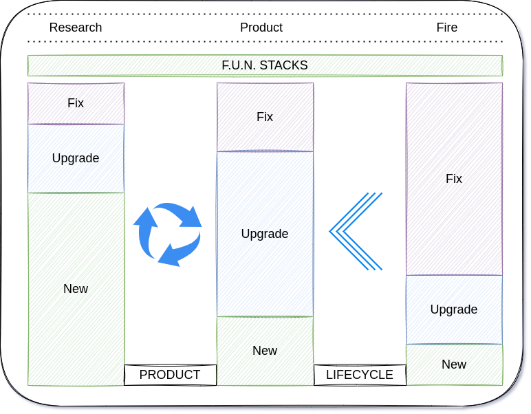

# CTA - Context-Technoloy-Asides

- capture use case specifications, requirements & acceptance criteria without hardcoding top-down requirements or having to manage-up

---

nimlangs styleguide: replace `code` with whatever it is you do

> Good code usually happens after several rewrites.
> On the first pass: the focus is on the problem, not the code.
> When the problem is well understood, the code can be rewritten.

---

## Observations

- the race team is a smart team, but...
  - we need to be creative and remove inapropriate barriers that restrict our solutions
- usually the 1s and 0s become more defined once we transition through the product life cycle, so...
  - shift right those 1s and 0s as far as possible
  - spread imagination throughout

## First Principles

- CTAs should be living documents:
  - a single CTA can go through multiple iterations and races
  - ownership being passed between multiple drivers and amongst multiple race teams
  - that new feature ticket? reuse it, recursively, adding new FUNstacks as the CTA evolves
- Participants should be responsive
- The process should be creative

## Outline

- context: the biz context; put on your CEO & forward-facing CTO hat
  - strive to provide what needs to be achieved, vs what needs to be completed
  - taking a declarative approach enables more flexibility in how downstream tasks materialize
  - the context should invoke questions of why, not questions of what or debates on how
- technology: the tech context & implementation strategy; put on your inward-facing CTO & engineer hat
  - how do we achieve the goals & vision setout by the context?
  - how do we build something resilient to future (and expected) changes
- asides: additional abbreviations supporting the biz & tech context

## FoF: Focus on Features

- All work is described as a feature
- you could say there is a single issue type, and that type is Feature

### FRFR: Features Reap Future Revenue

- every CTA should be bourn from a feature needed/provided
  - **F**: need to fix something? do it now or near-term, the Fire team is always available
  - **U**: need to upgrade something? increment the release version and deploy an improvement or enhancement
  - **N**: new ideas? nothing increases the bottom line new features and products

### F.U.N Stacks: Features are FUN

- each CTA should be creative, profitable, and FUN!

#### Fix

- brownfield > intolerables: straight to a race
- e.g. bugs, defects

#### Upgrade

- bluefield > enhancements & restrictions: line up in the grid
- e.g. tests, documentation, redesign, [enhancements improvements](https://learningenglish.voanews.com/a/improve-increase-or-enhance-/4900905.html)
- we dont use the word `refactor` in these parts of town cowboy

#### New

- greenfield > rapid prototyping & new product development: require pit boss approval
- everyone loves something new: can we afford it? can we win if we enter the race?

> 

### F.U.N Facts

- we Focus on Features
  - because features reap future revenue
  - because features are f.u.n
- thus, features apriori...
  - determine the overall composition of your FUNstack...
  - drive the management of races your drivers...
- ...

### F.U.N Plan

> 
