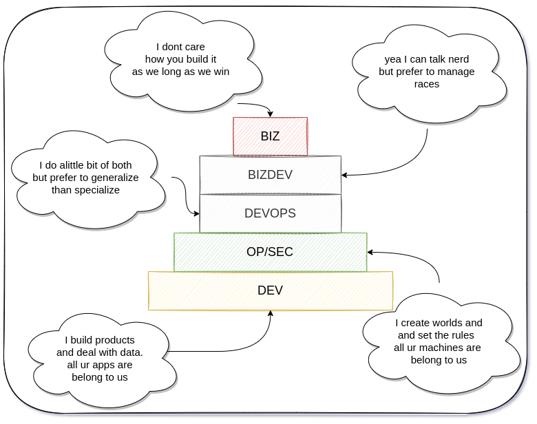

# RACExp Methodology

- **R**ealistic **A**gile **C**oncepts for **EX**treme **P**rogramming

> 

## TLDR

- uses the `race team metaphor` as the ontology of rapid prototyping/product development
  - Realistic: pragmatic organization & management approach for high performance developers, startups and enterprise teams
  - [Agile](https://www.metaltoad.com/blog/most-agile-thing-you-can-do-throw-away-agile): the practical parts of agile
  - [Concepts](https://en.wikipedia.org/wiki/Extreme_programming#Concept): overarching thereotical practices
  - [Extreme Programming](https://www.amazon.com/Extreme-Programming-Explained-Embrace-Change/dp/0321278658)

## RACE circuits

- aka sprints, 24 day iterations, 15 circuits a year

## RACE track

### [THE FIELD](https://en.wikipedia.org/wiki/Glossary_of_motorsport_terms)

- The competing races on a track.
  - `the pits` + `the grid`
  - all the tickets that could potentially be worked on

#### [THE PITS](https://en.wikipedia.org/wiki/Pit_stop)

- In motorsports, a pit stop is a pause for refueling, new tires, repairs, mechanical adjustments, a driver change, as a penalty, or any combination of the above. These stops occur in an area called the pits, most commonly accessed via a pit lane which runs parallel to the start/finish straightaway of the track
  - tickets that require business + engineering attention

#### [THE GRID](https://en.wikipedia.org/wiki/Glossary_of_motorsport_terms)

- The starting formation of a race, generally in rows of two for cars and three or four for bikes. The Indianapolis 500 traditionally has a unique grid of three cars per row.
  - tickets ready to be developed

### COMPETITION

> tracks _complexity of implementation_

- I like to use 4 in progress tracks (see `THE GROOVE` below)
- depending on the drivers part of your team, and each developers capabilities, will determine the set of in progress tickets and how they are categorized in the 4 in progress tracks
  - e.g. a junior devs GROOVE is far different than a senior devs GROOVE
    - [you want to keep all of your engineers in their GROOVE](https://computus.org/7-tips-for-programming-in-the-zone/)
- The optimal path around the track for the lowest lap time. In drag racing it is about the center portion of the lane, where the cars can gain traction quicker.
  - `SLOW lane` too many of these and your drivers wont be happy, forecasts wont be accurate, and the _fast_ lane will be over utilized to compensate for poor finishes
  - `THE GROOVE` [the optimal ticket](https://en.wikipedia.org/wiki/Glossary_of_motorsport_terms): your team is successful, drivers are winners, races are predictable
  - `FAST lane` too many of these means all your trophies are gold plated, but hey - you can fill your team with cheap engineers and junior devs
  - `THE LAST LAP` if our users arent using it then its not providing utility, and usually not useful to consider the ticket done, so use the last lap for this usecase
    - there are a lot of stats and insights to glean from plotting tickets on these 4 dimensions over time...
  - `DEPLOYED`: refrain from the use of `DONE` status, DONE doesnt exist in the real world; this also supports the adoption of `refactoring as a lifestyle`

#### ETD

> tracks estimated time to ~complete~ deploy

- tracked as total days till deployed in 2 day increments
- max allowed time should equal circuit length (24 days)

#### RACE Flags

- [RACING FLAGS](https://en.wikipedia.org/wiki/Racing_flags)
  - the dimensions on which a ticket is evaluated to ascertain quality:
    - basically anything you want, but all should be:
      - technical principals/best practices, e.g. DRY, SOLID, KISS, efficiency, effectiveness, etc.
      - not solvable by automation: keep your biases/opinions to a minimum and the team focused on finishing the race successfully, not perfectly
- [MEATBALL](https://en.wikipedia.org/wiki/Racing_flags#Black_flag)
  > only `meatballs` are rejected/reworked, everything else is pushed through
  - A mechanical black flag is a black flag with an orange disc in its center which indicates that a vehicle is being summoned to the pits due to serious mechanical problems or loose bodywork that presents a risk to other competitors. At some road racing events, it is used to summon the vehicle to the pits to inform the driver of violation "maximum sound levels.” Also known as the 'Meatball' flag.
- [YELLOW FLAG](https://en.wikipedia.org/wiki/Racing_flags#Yellow_flag)
  > _too many_ yellow flags and a ticket could be labeled a meatball _too few_ yellow flags is indicative of over optimizing/no critical feedback
  - dont over optimize, be overly optimistic
  - dont push things through without identifying future rework
    - the idea being all tech is techdebt eventually, there is no perfectly groomed/scoped ticket. eventually all work will be reworked
    - this idea should be built into your strategic planning and accepted as a first principle
  - The solid yellow flag, or caution flag, universally requires drivers to slow down due to a hazard on the track, typically an accident, a stopped car, debris or light rain. However, the **procedures for displaying the yellow flag vary for different racing styles and sanctioning bodies**.
- [CHEQUERED FLAG](https://en.wikipedia.org/wiki/Racing_flags#The_chequered_flag)
  > keep track of the tickets that represent the flawless fatality and apply the chequered flag
  - Useful for keeping track of [all the factors](https://www.nature.com/articles/s41467-021-25477-8) that were in alignment for a particular ticket, developer, PM, etc that joined together and executed fkn flawlessly.
    - you should ask yourself right now: Do you know the specific levers to pull in order to push your team across the finish line... and if you have the data to back that shit up
  - The chequered flag (or checkered flag) is displayed at the start/finish line to indicate that the race is officially finished. At some circuits, the first flag point will display a repeat chequered flag (usually on the opposite side of the circuit). The flag is commonly associated with the winner of a race, as they are the first driver to "take" (in other words, drive past) the chequered flag.

#### [ADR-TYPES](https://adr.github.io/)

- for tracking architectural decision records of a particular type
- architecture is key to turning tech-debt into tech-features
- these labels are applied to races in competition that signficantly impact future work
  - biz
  - dev
  - ops
  - sec

## RACE Teams

> 

### Research Team

- the most creative
- Visionaries, fearless, just dgaf

### Product Team

- the most performant
- can build anything... fast

### Fire Team

- the most knowledgeable
- the team part of every other team, can do anyones job, even yours

## etc

- [managing race teams](https://www.youtube.com/watch?v=c1n-rgqSTyY)
