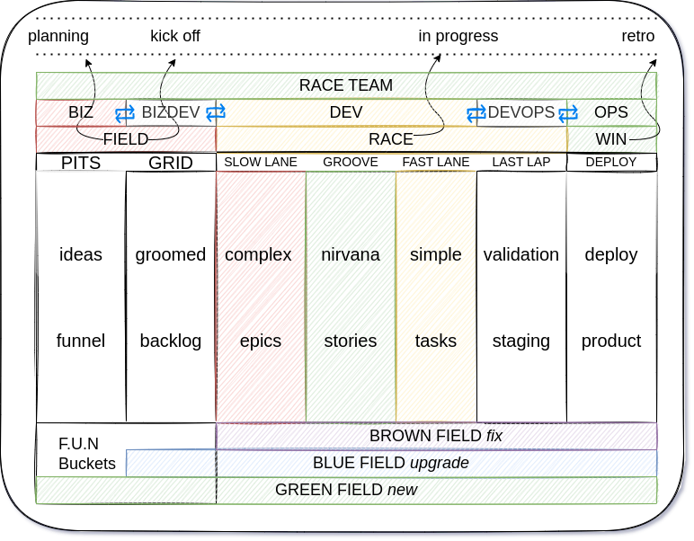

# BizDevOps @ NIRV

- [DevBizOps](https://enterprisersproject.com/article/2019/9/devops-what-is-bizdevops)

## RACExP

- Shifting Prod & Proj management into development
- **RACEXP**: **R**ealistic **A**gile **C**oncepts for **EX**tream **P**rogramming
  - 
  - [read more](./0racexp.md)

## HECC-YA

- Holistic approach to immutable architecture
- **HECC-YA**: **h**ardware **e**nvironment **c**omponent **c**ommunication **y**ielding **a**rchitecture
  - [read more](./0heccya.md#hecc-ya-system-modeling)

## CTA

- Use case call to actions
- **CTA**: **C**ontext **T**echnology **A**sides
- [read more](./0cta.md)
