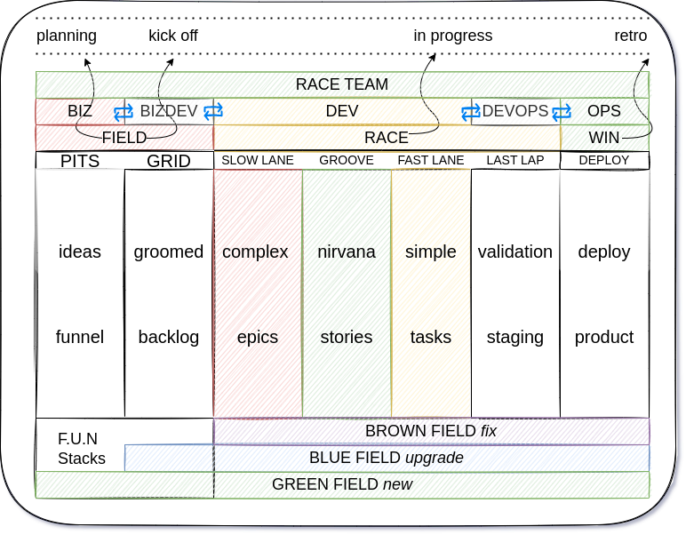
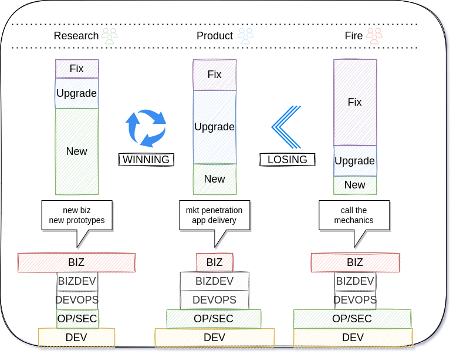

# [BizDevOps](https://enterprisersproject.com/article/2019/9/devops-what-is-bizdevops) @ NIRV

> understanding all of our planning... triangulate the ideal path towards a future state of being. @NIRV

## RACExp

> 

- Holistic approach for product and research development RACExp teams
- **RACEXP**: **R**ealistic **A**gile **C**oncepts for **EX**tream **P**rogramming
  - [read more](./0racexp.md)

## HECC-YA

- Holistic approach for zero-trust immutable systems, services and applications
- **HECC-YA**: **h**ardware **e**nvironment **c**omponent **c**ommunication **y**ielding **a**rchitecture
  - [read more](./0heccya.md#hecc-ya-system-modeling)

## F.U.N. Plan

> 

- Planning F.U.N. stacks of CTAs
  - [read more](./0funplan.md)

## Terminology

- driver
- racetrack
- funstack
- raceteam
- biz (raceteam)
- bizdev (raceteam)
- dev (raceteam)
- devops (raceteam)
- [op/sec](https://www.commerce.gov/osy/programs/operations-security-opsec) (raceteam)
- field (racetrack)
- pits (field)
- grid (field)
- race (racetrack)
- slow lane (race)
- groove (race)
- fast lane (race)
- last lap (race)
- win (racetrack)
- brownfield (funstack)
- bluefield (funstack)
- greenfield (funstack)
