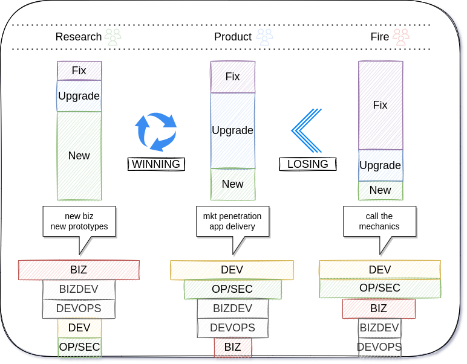

# BizDevOps @ NIRV

> understanding all of our planning... triangulate the ideal path towards a future state of being. @NIRV

> 

## RACExp

- Holistic high performance bizdevops teams
- **RACEXP**: **R**ealistic **A**gile **C**oncepts for **EX**tream **P**rogramming
  - [read more](./0racexp.md)

> 

## HECCYA

- Holistic zero-trust immutable systems, services and applications
- **HECCYA**: **h**ardware **e**nvironment **c**omponent **c**ommunication **y**ielding **a**rchitecture
  - [read more](./0heccya.md#hecc-ya-system-modeling)

## F.U.N. Plan

- Planning stacks of F.U.N.
  - [read more](./0funplan.md)

> 

## Taxonomy

- 5Dubs (heccya)
- AD (ADR) architectural decision
- ADR (racexp) [we primarily much follow githubs guidelines, with a twist](https://adr.github.io/)
- AKM (ADR) architectural knowledge management
- architecture (heccya)
- ASR (ADR) architecturally significant record
- biz (raceteam)
- bizdev (raceteam)
- bizdevops (raceteam) [(almost) everyone you need to win](https://enterprisersproject.com/article/2019/9/devops-what-is-bizdevops)
- bluefield (funstack)
- brainstorm (funplan) planning
- brownfield (funstack)
- celebration (funplan) retrospective
- communication (heccya)
- competition (funplan) in progress
- component (heccya)
- cta (funplan)
- deploy (win)
- dev (raceteam)
- devops (raceteam)
- DL (ADR) decision log
- driver (cta)
- environment (heccya)
- fast lane (race)
- field (racetrack)
- fire team (raceteam)
- FoF (funplan)
- FRFR (funplan)
- fruition (funplan) kick off
- funfacts (funplan)
- funplan (racexp)
- funstack (funplan)
- greenfield (funstack)
- grid (field)
- groove (race)
- hardware (heccya)
- heccya (racexp) [we primarily follow the AWS guidelines, with a twist](https://aws.amazon.com/blogs/apn/the-6-pillars-of-the-aws-well-architected-framework/)
- last lap (race)
- losing (funplan)
- op/sec (raceteam) [operations and security](https://www.commerce.gov/osy/programs/operations-security-opsec)
- pits (field)
- product team (raceteam)
- race (racetrack)
- raceteam (racexp)
- racetrack (racexp)
- racexp: organizational structure and management methodology rooted in collective intelligence
- research team (raceteam)
- slow lane (race)
- win (racetrack)
- winning (funplan)
- yielding (heccya)
